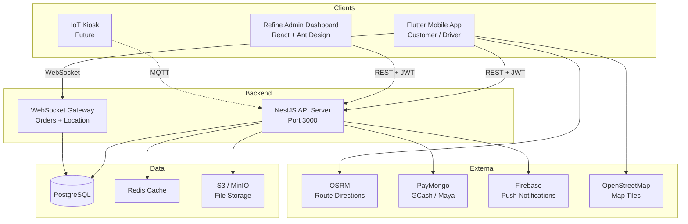
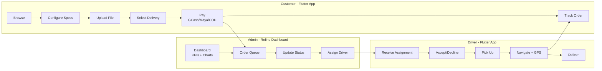
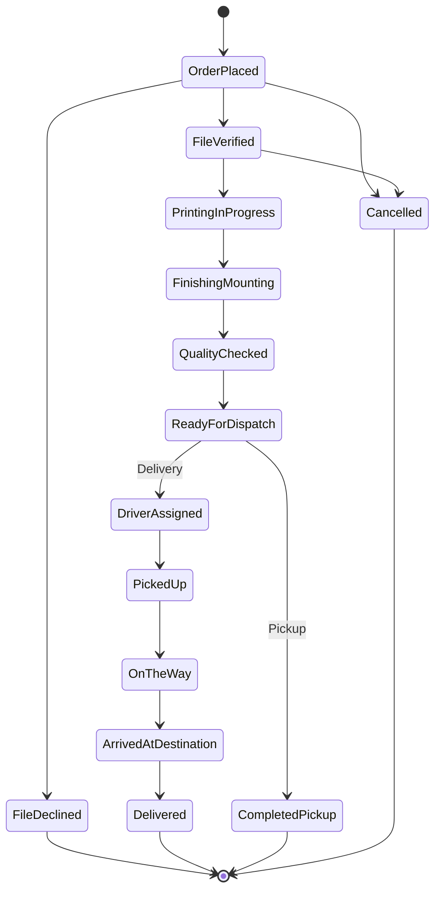

# GRID

**TAP TO PLOT. Simplified. Printing.**

A premium printing service delivery platform — paper and 3D printing as easy as ordering food delivery.

[](https://github.com/rqms40/printing_app/actions/workflows/ci-mobile.yml)
[](https://github.com/rqms40/printing_app/actions/workflows/ci-server.yml)
[](https://github.com/rqms40/printing_app/actions/workflows/ci-admin.yml)

---

## Architecture



## User Flows



## Order Status Pipeline



## Project Structure

```
grid/
├── apps/
│   └── mobile/              # Flutter app (Customer + Driver)
│       ├── lib/
│       │   ├── config/      # Theme, routes, constants
│       │   ├── features/    # Feature-first modules
│       │   │   ├── auth/    # Login, register, profile
│       │   │   ├── customer/# Home, orders, notifications, tracking
│       │   │   ├── driver/  # Deliveries, active delivery, history
│       │   │   └── admin/   # Mobile admin screens (legacy)
│       │   ├── shared/      # Widgets, models, providers, services
│       │   └── utils/       # Formatters, validators, pricing
│       └── test/            # 140 tests
│
├── admin/                   # Refine admin dashboard (React)
│   ├── src/
│   │   ├── pages/           # Dashboard, Orders, Drivers, Users, Products
│   │   ├── components/      # Header, KPI Card, Status Badge, Logo
│   │   ├── providers/       # Auth, Data, Mock Data
│   │   ├── config/          # Theme (Ant Design), Constants
│   │   └── styles/          # Global CSS
│   ├── package.json         # Vite + React + Refine + Ant Design
│   └── vite.config.ts
│
├── server/                  # NestJS backend
│   ├── src/
│   │   ├── admin/           # Admin-only endpoints (dashboard, queue)
│   │   ├── auth/            # JWT + Passport
│   │   ├── users/           # Profile management
│   │   ├── orders/          # CRUD + WebSocket
│   │   ├── addresses/       # Delivery addresses
│   │   ├── drivers/         # Assignments + GPS
│   │   ├── payments/        # PayMongo integration
│   │   ├── notifications/   # In-app + FCM
│   │   ├── files/           # File upload
│   │   ├── firebase/        # Firebase Admin SDK
│   │   ├── health/          # Health check + DB probe
│   │   └── common/          # Guards, filters, interfaces
│   ├── test/                # 48 tests
│   ├── docker-compose.yml   # PostgreSQL + Redis
│   ├── Dockerfile           # Multi-stage production build
│   └── .env.example         # Environment variables template
│
├── packages/
│   └── api-types/           # Shared API type definitions (planned)
│
├── docs/
│   ├── PRD.md               # Product Requirements (v3)
│   └── superpowers/         # Design specs + plans
│
├── .github/workflows/       # CI/CD (mobile + server + admin + release)
├── Makefile                  # Common commands
└── README.md
```

## Tech Stack

| Layer | Technology | Purpose |
|-------|-----------|---------|
| **Mobile** | Flutter 3.41.6 + Dart 3.11.4 | Customer + Driver app |
| **Admin** | React + Refine + Ant Design | Admin dashboard (web) |
| **State (mobile)** | Riverpod 2.6.1 | Reactive state management |
| **State (admin)** | Refine data providers | REST data fetching + caching |
| **Navigation** | GoRouter (mobile) / React Router (admin) | Declarative routing |
| **Maps** | flutter_map + OpenStreetMap | Free maps, no API key |
| **Routing** | OSRM | Free driving directions |
| **Icons** | HugeIcons (mobile) / Ant Design Icons (admin) | Icon sets |
| **Backend** | NestJS 11 + TypeScript | Modular REST + WebSocket API |
| **Database** | PostgreSQL 15 | Relational data |
| **Auth** | Passport.js + JWT | Stateless authentication |
| **Security** | Helmet + Throttler | HTTP headers + rate limiting |
| **Payments** | PayMongo | GCash, Maya, Card (Philippines) |
| **Push** | Firebase Cloud Messaging | Push notifications |
| **Real-time** | Socket.IO | Order tracking + driver GPS |
| **CI/CD** | GitHub Actions | Automated lint, test, build |
| **Container** | Docker | Production deployment |

## Quick Start

### Prerequisites

- Flutter 3.41.6 ([FVM](https://fvm.app) recommended)
- Node.js 20+ and npm
- Docker (for PostgreSQL)

### Development

```bash
# 1. Clone
git clone git@github.com:rqms40/printing_app.git
cd printing_app

# 2. Start database
cd server
cp .env.example .env
docker-compose up -d

# 3. Start API server
npm install
npm run seed        # Load demo data
npm run start:dev   # http://localhost:3000/docs (Swagger)

# 4. Start mobile app (new terminal)
cd apps/mobile
fvm flutter pub get
fvm flutter run

# 5. Start admin dashboard (new terminal)
cd admin
npm install
npm run dev         # http://localhost:5173
```

### Demo Credentials

| Role | Email | Password |
|------|-------|----------|
| Customer | maria@gridprint.ph | password123 |
| Driver | juan@gridprint.ph | password123 |
| Admin | admin@gridprint.ph | password123 |

> Mobile app also has dev bypass buttons on the login screen for quick testing without a server.

## Apps

### Mobile (`apps/mobile/`)
Flutter app serving Customer + Driver roles with 34 screens:
- Order placement with paper/3D specs configuration
- Real-time delivery tracking with OpenStreetMap + OSRM routing
- Offline draft persistence with Hive
- Push notifications via Firebase Cloud Messaging
- Dark mode with system theme detection

### Admin Dashboard (`admin/`)
Refine + React web dashboard for shop administrators:
- Dashboard with KPI cards and charts (orders, revenue, production)
- Order queue with tabs (New / In Production / Done / All), search, status updates
- Order detail with status timeline, driver assignment, audit trail
- Driver management with availability tracking
- User management
- Product catalog
- Dark theme with DM Sans font
- Mock data fallback when server is offline

### Server (`server/`)
NestJS backend providing REST API + WebSocket:
- 11 modules: Admin, Auth, Users, Orders, Addresses, Drivers, Payments, Notifications, Files, Firebase, Health
- 11 database entities with TypeORM
- JWT authentication with role-based access control (customer/driver/admin)
- WebSocket gateways for real-time order updates + driver GPS
- Firebase Admin SDK for push notifications
- Rate limiting (Helmet + Throttler)
- Swagger API docs at `/docs`

## Testing

```bash
# Mobile (140 tests)
cd apps/mobile && fvm flutter test

# Server (48 tests)
cd server && npm test

# Admin
cd admin && npm run build  # Type check

# Lint
cd apps/mobile && fvm flutter analyze
cd server && npm run lint
```

## Deployment

### Docker (production)

```bash
cd server
docker-compose up -d --build  # Builds API + PostgreSQL + Redis
```

### Release APK

```bash
git tag v1.0.0
git push origin v1.0.0  # Triggers GitHub Actions → APK release
```

## Development Status

- [x] Phase 1: UI Shell (34 screens, 3 roles)
- [x] Phase 2: Local Logic (Hive drafts, dark mode, connectivity)
- [x] Phase 3: NestJS Backend (11 modules, 11 entities)
- [x] Phase 4: Flutter ↔ API Integration
- [x] Phase 5: Admin Dashboard (Refine + React)
- [x] CI/CD Pipelines (mobile + server + admin)
- [x] Firebase Push Notifications
- [x] Test Suite (188+ tests)
- [ ] PayMongo Live Integration
- [ ] S3/R2 File Storage
- [ ] Production Deployment

## License

Proprietary — GRID Print Services
