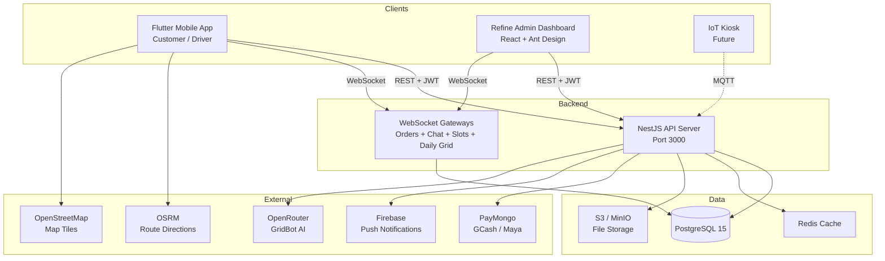
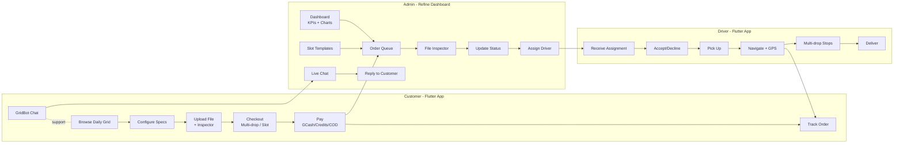
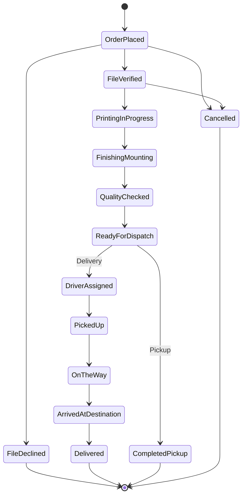

# GRID

**TAP TO PLOT. Simplified. Printing.**

A premium printing service delivery platform — paper and 3D printing as easy as ordering food delivery.

[](https://github.com/rqms40/printing_app/actions/workflows/ci-mobile.yml)
[](https://github.com/rqms40/printing_app/actions/workflows/ci-server.yml)
[](https://github.com/rqms40/printing_app/actions/workflows/ci-admin.yml)

---

## Architecture



## User Flows



## Order Status Pipeline



## Project Structure

```
grid/
├── apps/
│   └── mobile/                        # Flutter app (Customer + Driver)
│       ├── lib/
│       │   ├── config/                # Theme, routes, constants
│       │   ├── features/
│       │   │   ├── auth/              # Login, register, profile setup
│       │   │   ├── onboarding/        # First-login role slides
│       │   │   ├── tutorial/          # Pipeline walkthrough + coach marks
│       │   │   ├── customer/
│       │   │   │   ├── home/          # Bento grid + Daily Grid + greeting
│       │   │   │   ├── order/         # Category → specs → upload → checkout
│       │   │   │   ├── orders/        # Active + history with admin status banner
│       │   │   │   ├── tracking/      # Live driver map, ETA badge
│       │   │   │   ├── address/       # Saved addresses + multi-drop assignment
│       │   │   │   ├── chat/          # GridBot AI + admin/rider live chat
│       │   │   │   ├── beta/          # Beta enrollment + 1-order limit
│       │   │   │   ├── cart/          # Cart-style batch builder
│       │   │   │   ├── notifications/ # In-app inbox
│       │   │   │   ├── uploads/       # My Uploads + retention settings
│       │   │   │   └── profile/       # Account, TAM survey, preferences
│       │   │   ├── driver/            # Deliveries, active delivery, history
│       │   │   └── admin/             # Mobile admin queue + dashboard
│       │   ├── shared/                # Widgets, models, providers, services
│       │   └── utils/                 # Formatters, validators, pricing
│       └── test/                      # 300+ unit/widget/integration tests
│
├── admin/                             # Refine admin dashboard (React + Vite)
│   ├── src/
│   │   ├── pages/
│   │   │   ├── dashboard/             # KPIs, charts, users analytics tab
│   │   │   ├── orders/                # Queue, detail, manual status, preview
│   │   │   ├── drivers/               # Availability + GPS
│   │   │   ├── users/                 # Customer detail + recent orders
│   │   │   ├── delivery-slots/        # Templates + Today's view
│   │   │   ├── beta-mode/             # Beta enrollment management
│   │   │   ├── chat/                  # Conversation list + thread
│   │   │   ├── tam-surveys/           # Submission viewer
│   │   │   ├── notifications/        # Marketing notification composer
│   │   │   ├── credit-requests/       # Customer credit top-up review
│   │   │   ├── admin-settings/        # Delivery + printer settings
│   │   │   └── external-deliveries/   # Maxim/Grab integration
│   │   ├── components/
│   │   │   ├── chat/                  # ConversationList, MessageBubble, TypingIndicator
│   │   │   ├── file-inspector/        # PDF page-count + STL/OBJ CAD viewer
│   │   │   ├── file-preview-modal.tsx # Per-row file preview with inspection
│   │   │   └── show-page.tsx          # Shared show-detail layout
│   │   ├── providers/                 # Auth, data, chat-ws, delivery-slot-ws
│   │   └── services/                  # betaModeApi
│   └── test/                          # 80+ vitest tests
│
├── server/                            # NestJS backend
│   ├── src/
│   │   ├── admin/                     # Admin-only endpoints (dashboard, queue)
│   │   ├── auth/                      # JWT + Passport, profile setup
│   │   ├── users/                     # Profile, storage settings, tutorial keys
│   │   ├── orders/                    # CRUD + WebSocket + batch + manual status
│   │   ├── addresses/                 # Delivery addresses
│   │   ├── drivers/                   # Assignments + GPS
│   │   ├── delivery-slots/            # Templates, bookings, geo-radius
│   │   ├── credits/                   # GRID Credits top-up + ledger
│   │   ├── chat/                      # Conversations + messages + GridBot AI
│   │   ├── beta-mode/                 # Beta enrollment + per-user limits
│   │   ├── daily-grid/                # Curated daily catalog cards
│   │   ├── printer-profile/           # Per-printer build volume limits
│   │   ├── tam-surveys/               # Survey requirements + submissions
│   │   ├── files/                     # Upload + S3 + analysis (PDF/3D/paper-size)
│   │   ├── payments/                  # PayMongo integration
│   │   ├── notifications/             # In-app + FCM + marketing scheduler
│   │   ├── firebase/                  # Firebase Admin SDK
│   │   ├── storage/                   # S3/MinIO storage service
│   │   ├── health/                    # Health check + DB probe
│   │   └── common/                    # Guards, filters, interfaces
│   ├── migrations/                    # TypeORM migrations
│   ├── test/                          # 350+ unit + integration tests
│   ├── docker-compose.yml             # PostgreSQL + Redis
│   ├── Dockerfile                     # Multi-stage production build
│   └── .env.example                   # Environment variables template
│
├── packages/
│   └── api-types/                     # Shared API type definitions
│
├── docs/
│   ├── PRD.md                         # Product Requirements (v3)
│   ├── PRD_SysArchi.md                # System architecture diagram
│   └── superpowers/                   # Design specs + implementation plans
│
├── .github/workflows/                 # CI/CD (mobile + server + admin + release)
├── Makefile                           # Common commands
└── README.md
```

## Tech Stack

| Layer | Technology | Purpose |
|-------|-----------|---------|
| **Mobile** | Flutter 3.41.6 + Dart 3.11.4 | Customer + Driver app (FVM-pinned) |
| **Admin** | React 18 + Refine + Ant Design + Vite | Admin dashboard (web) |
| **State (mobile)** | Riverpod 2.6.1 (StateNotifier) | Reactive state management |
| **State (admin)** | Refine data providers | REST data fetching + caching |
| **Navigation** | GoRouter (mobile) / React Router 6 (admin) | Declarative routing |
| **Maps** | flutter_map + OpenStreetMap | Free maps, no API key |
| **Routing** | OSRM | Free driving directions |
| **3D Viewer** | three.js + @react-three/fiber + @react-three/drei | Admin STL/OBJ/GLB inspector |
| **PDF Viewer** | pdf-lib (admin) + pdfx (mobile) | Page-count extraction + preview |
| **Coach Marks** | tutorial_coach_mark 1.3.3 | In-app tutorial pipeline |
| **Icons** | HugeIcons (mobile) / Ant Design Icons (admin) | Icon sets |
| **Backend** | NestJS 11 + TypeScript | Modular REST + WebSocket API |
| **Database** | PostgreSQL 15 + TypeORM | Relational data + migrations |
| **Auth** | Passport.js + JWT | Stateless authentication |
| **Security** | Helmet + Throttler + RA 10173 compliance | HTTP headers + rate limiting |
| **Payments** | PayMongo (GCash + Card) + GRID Credits ledger | Payment + wallet |
| **Push** | Firebase Cloud Messaging + APNs | Push notifications |
| **Real-time** | Socket.IO (4 gateways) | Orders + Chat + Slots + Daily Grid |
| **AI** | OpenRouter (GridBot prompt) | In-app support assistant |
| **Storage** | S3-compatible (MinIO / AWS S3) | File uploads + retention purge |
| **Local cache (mobile)** | Hive + SharedPreferences | Offline drafts + tutorial state |
| **CI/CD** | GitHub Actions | Lint, test, build, release APK |
| **Container** | Docker + Compose | Production deployment |

## Quick Start

### Prerequisites

- Flutter 3.41.6 ([FVM](https://fvm.app) recommended)
- Node.js 20+ and npm
- Docker (for PostgreSQL)

### Development

```bash
# 1. Clone
git clone git@github.com:rqms40/printing_app.git
cd printing_app

# 2. Start database
cd server
cp .env.example .env
docker-compose up -d

# 3. Install + run migrations + seed
npm install
npm run migration:run   # apply TypeORM migrations
npm run seed            # load demo data
npm run start:dev       # http://localhost:3000/docs (Swagger)

# 4. Start mobile app (new terminal)
cd apps/mobile
fvm flutter pub get
fvm flutter run

# 5. Start admin dashboard (new terminal)
cd admin
npm install
npm run dev             # http://localhost:5173
```

### Demo Credentials

| Role | Email | Password |
|------|-------|----------|
| Customer | maria@gridprint.ph | password123 |
| Driver | juan@gridprint.ph | password123 |
| Admin | admin@gridprint.ph | password123 |

> Mobile app also has dev bypass buttons on the login screen for quick testing without a server.

## Apps

### Mobile (`apps/mobile/`)

Flutter app serving Customer + Driver roles. Highlights of what's currently shipped:

**Customer experience**
- **In-app tutorial** — multi-screen guided pipeline walkthrough (welcome → Start Printing → category → specs → upload → checkout → place order) with auto-positioning coach marks; post-order discovery pass for Credits, GridBot, Multi-drop, and live tracking; "Reset Tutorials" in profile preferences.
- **Onboarding** — first-login role-picker slides; staged registration with profiling.
- **Bento home** — Daily Grid section (curated catalog with real-time WebSocket updates), Resume-your-Queue card, Recent Orders, GridBot floating chat button, GRID Credits chip, batch session trigger dialog.
- **Order pipeline** — Category → Paper/3D specs → Upload → Checkout. Paper specs include size, color mode, media, sides, binding, copies; 3D specs include format, material, color, infill, layer height, supports + manual W×H×D check vs printer build volume (Bambu A1 / A1 Mini).
- **Upload screen** — drag-drop file card, real Dio progress, instant validation, file preview sheet, ruler overlay (draggable triangular scale ruler with 1:1/1:50/1:100/1:200/1:500 toggle), CMYK/RGB warning, dimension mismatch warning.
- **Cart-style batch checkout** — multiple items in one transaction, swipe-to-remove, edit-all-specs, per-copy multi-drop assignment, address picker sheet, slot picker sheet, payment-method sheet, summary card with subtotal/delivery/total, sticky place-order footer.
- **Delivery options** — single delivery, pickup, or multi-drop (up to 5 destinations with per-stop fees); scheduled delivery via slot picker (templates × geo-radius × today's availability).
- **GRID Credits wallet** — custom-amount top-up via PayMongo GCash, credits never expire, "Pay with GRID Credits" payment row appears when balance ≥ order total, profile shows ledger.
- **Live chat** — dedicated Chat tab with conversation list. Two backends: AI GridBot (OpenRouter, 24/7 support) and human admin/rider (WebSocket-backed real-time messaging, typing indicator, message bubbles, chat avatar).
- **Beta mode** — beta enrollment status indicator, post-delivery TAM survey lockout, 1-order limit while in beta with informational sheet.
- **My Uploads** — view + delete previously uploaded files; per-user file retention setting (auto-purge cron).
- **Live tracking** — flutter_map + OSRM driving route, driver marker updates every few seconds, ETA badge, swipeable destination cards on multi-drop.
- **Notifications** — grouped inbox with day headers, unread count, mark-as-read.
- **Profile** — account details, storage settings, request-a-feature card, TAM survey (required + optional flows), reset tutorials, notification preferences, dark mode toggle.

**Driver experience** — assignment dashboard, accept/decline, checkpoint status (picked up → on the way → arrived → delivered), live GPS streaming, multi-drop sequential stops, history + earnings.

### Admin Dashboard (`admin/`)

Refine + React web dashboard for shop administrators:
- **Dashboard** — KPI cards (new, in-production, ready, revenue), 6-month sales + volume charts, Users analytics tab.
- **Orders queue** — tabs (New / In Production / Done / All), search, status dropdown, manual status note for 3D orders, decline-with-reason, audit timeline, driver-assignment modal.
- **File inspector** — modal with PDF page-count extractor + RA 10173-aware presigned URL fetch + interactive 3D viewer for STL/OBJ/GLB models. Per-row file preview button on multi-item orders.
- **Drivers** — availability list, last GPS update, assignment history.
- **Users** — customer detail with metrics, recent orders, profile fields.
- **Delivery slots** — Templates page (capacity, time windows, geo-radius) + Today's view (live booked counts via WS).
- **Beta mode** — enrollment management.
- **Live chat** — conversation list, message thread, real-time WS updates, reply form.
- **Marketing notifications** — composer with iOS-style live preview, frequency (6h/daily/monthly), active toggle, FCM + email blast.
- **TAM surveys** — submission viewer.
- **Credit requests** — review customer top-up requests.
- **Admin settings** — delivery zones, printer profiles.
- **External deliveries** — Maxim / Grab Express handoff for out-of-zone destinations.
- **Theming** — dark theme with DM Sans font; mock data fallback when server is offline.

### Server (`server/`)

NestJS backend providing REST API + WebSocket. **23 modules**, **3 migrations**, **350+ tests**.

Modules:
- **admin** · **auth** · **users** · **orders** (with batch + delivery destinations + speed tier) · **addresses** · **drivers**
- **delivery-slots** (templates, bookings, settings, geo-radius, WS gateway)
- **credits** (top-up + ledger)
- **chat** (conversations, messages, GridBot OpenRouter prompt, WS gateway)
- **beta-mode** (settings, enrollment, per-user 1-order limit)
- **daily-grid** (curated cards + WS gateway)
- **printer-profile** (per-printer build volume limits)
- **tam-surveys** (requirements + submissions)
- **files** (S3 storage, file analysis service for PDF/3D/paper-size validation, retention purge cron, GLB encoder)
- **payments** (PayMongo)
- **notifications** (in-app + FCM + marketing scheduler with broadcast)
- **firebase** (Admin SDK)
- **storage** (S3/MinIO config)
- **health** (DB probe)
- **common** (guards, filters, interceptors, exception filter that logs + forwards structured errors)

Other:
- 4 WebSocket gateways: orders, chat, delivery-slots, daily-grid
- Role-based access control: customer / driver / admin
- Rate limiting (Helmet + Throttler), Swagger docs at `/docs`
- TypeORM migrations: `1714435200000-add-speed-tier-and-payment-default`, `1715040000000-drop-priority-boolean`, `1777507200000-add-tutorial-seen-keys`

## Testing

```bash
# Mobile (300+ tests across unit, widget, integration)
cd apps/mobile && fvm flutter test

# Server (350+ tests, Jest)
cd server && npm test

# Admin (80+ tests, Vitest + Testing Library)
cd admin && npm test
cd admin && npm run build   # type check + production build

# Lint
cd apps/mobile && fvm flutter analyze
cd server && npm run lint
```

## Deployment

### Docker (production)

```bash
cd server
docker-compose up -d --build  # Builds API + PostgreSQL + Redis
```

### Release APK

```bash
git tag v1.0.0
git push origin v1.0.0  # Triggers GitHub Actions → APK release
```

## Development Status

- [x] Phase 1: UI Shell (3 roles, full screen inventory)
- [x] Phase 2: Local Logic (Hive drafts, dark mode, connectivity, draft storage)
- [x] Phase 3: NestJS Backend (23 modules, TypeORM migrations)
- [x] Phase 4: Flutter ↔ API Integration (dio interceptors, auth refresh)
- [x] Phase 5: Admin Dashboard (Refine + React + Vitest)
- [x] Phase 6: Cart-style Batch Checkout (multi-item single-transaction orders)
- [x] Phase 7: Delivery Slot Booking (templates × geo-radius × real-time capacity)
- [x] Phase 8: Multi-drop Delivery (per-copy assignment, sequential stops)
- [x] Phase 9: Live Chat (GridBot AI + human support, WS-backed)
- [x] Phase 10: Beta Mode (enrollment, post-delivery TAM lockout, 1-order limit)
- [x] Phase 11: GRID Credits Wallet (top-up + ledger + payment method)
- [x] Phase 12: File Inspector (PDF page-count + STL/OBJ/GLB CAD viewer)
- [x] Phase 13: File Retention (per-user storage settings + purge cron)
- [x] Phase 14: In-App Tutorial (pipeline walkthrough + post-order feature pass)
- [x] CI/CD Pipelines (mobile + server + admin)
- [x] Firebase Push Notifications + Marketing Scheduler
- [x] Test Suite (730+ tests across all apps)
- [ ] PayMongo Live Integration (sandbox → production)
- [ ] S3/R2 File Storage in production
- [ ] Production Deployment

## License

Proprietary — GRID Print Services
