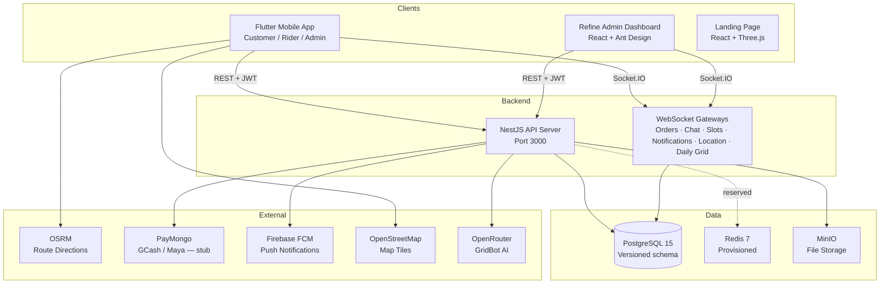
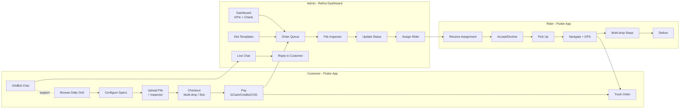

# GRIDGO

**TAP TO PLOT. Simplified. Printing.**

A premium printing service delivery platform — paper and 3D printing as easy as ordering food delivery. Built for the Philippine market.

[](https://github.com/rqms40/printing_app/actions/workflows/ci-mobile.yml)
[](https://github.com/rqms40/printing_app/actions/workflows/ci-server.yml)
[](https://github.com/rqms40/printing_app/actions/workflows/ci-admin.yml)

---

## Architecture



## User Flows



## Order Status Pipeline


## Project Structure

```
printing_app/
├── apps/
│   ├── mobile/                        # Flutter app (Customer + Rider + Admin)
│   │   ├── lib/
│   │   │   ├── config/                # Theme, routes, constants, page transitions
│   │   │   ├── features/
│   │   │   │   ├── auth/              # Login, register, profile setup, onboarding
│   │   │   │   ├── tutorial/          # Pipeline walkthrough + coach marks
│   │   │   │   ├── customer/
│   │   │   │   │   ├── home/          # Bento grid, Daily Grid, credits chip
│   │   │   │   │   ├── order/         # Category → specs → upload → checkout
│   │   │   │   │   ├── orders/        # Active + history with status banner
│   │   │   │   │   ├── tracking/      # Live rider map, ETA badge, OSRM route
│   │   │   │   │   ├── address/       # Saved addresses + multi-drop assignment
│   │   │   │   │   ├── chat/          # GridBot AI + admin/rider live chat
│   │   │   │   │   ├── beta/          # Beta enrollment + testimonial wall
│   │   │   │   │   ├── notifications/ # In-app inbox + WebSocket updates
│   │   │   │   │   ├── uploads/       # My Uploads + retention settings
│   │   │   │   │   └── profile/       # Account, TAM survey, top-up, preferences
│   │   │   │   ├── rider/            # Deliveries, active delivery, history, earnings
│   │   │   │   └── admin/             # Mobile admin queue + dashboard
│   │   │   ├── shared/                # Widgets, models, providers, services
│   │   │   └── utils/                 # Formatters, validators, pricing engine
│   │   └── test/                      # 424 unit / widget / integration tests
│   │
│   ├── Landing-page/                  # Marketing landing page (React 19 + Three.js)
│   │   ├── src/
│   │   │   ├── App.tsx                # All sections in one file (~615 lines)
│   │   │   ├── components/
│   │   │   │   ├── PhoneScene.tsx     # Scroll-driven 3D WebGL phone animation
│   │   │   │   └── PhoneModel.tsx     # GLTF loader for smartphone.glb
│   │   │   └── index.css              # Tailwind v4 theme, bg-map parallax
│   │   └── public/smartphone.glb      # 3D phone model asset
│   │
├── admin/                             # Production Refine admin dashboard (React 18 + Ant Design)
│   ├── src/
│   │   ├── pages/
│   │   │   ├── dashboard/             # KPIs, charts (operations/orders/users tabs)
│   │   │   ├── orders/                # Queue, detail, file preview, manual status
│   │   │   ├── riders/               # Live GPS map, dispatch queue, roster
│   │   │   ├── users/                 # Customer profiles + order history
│   │   │   ├── products/              # Dynamic catalog (categories + spec options + addons)
│   │   │   ├── delivery-slots/        # Weekly templates + today's live board
│   │   │   ├── beta-mode/             # Enrollment management, survey exemptions
│   │   │   ├── chat/                  # Support inbox, conversation thread
│   │   │   ├── tam-surveys/           # Submission viewer + feed approval
│   │   │   ├── notifications/         # Marketing notification composer
│   │   │   ├── credit-requests/       # Top-up review + proof of payment
│   │   │   ├── daily-grid/            # Home screen carousel card manager
│   │   │   ├── external-deliveries/   # Third-party courier handoff queue
│   │   │   └── settings/              # Delivery zone map + printer profile
│   │   ├── components/
│   │   │   ├── chat/                  # ConversationList, MessageBubble, TypingIndicator
│   │   │   ├── file-inspector/        # PDF viewer + STL/OBJ/GLB CAD viewer (Three.js)
│   │   │   └── notification-bell/     # Real-time badge with dropdown
│   │   └── providers/                 # Auth, data, chat-ws, delivery-slot-ws, notification-ws
│   └── src/                           # 23 Vitest test files (not currently run in CI)
│
├── server/                            # NestJS 11 backend
│   ├── src/
│   │   ├── admin/                     # Admin-only endpoints (dashboard, analytics, queue)
│   │   ├── auth/                      # JWT + Passport, registration, login
│   │   ├── users/                     # Profile, storage settings, tutorial keys, FCM token
│   │   ├── orders/                    # CRUD + WebSocket + batch + manual status
│   │   ├── addresses/                 # Delivery addresses
│   │   ├── riders/                   # Assignments, GPS updates, earnings
│   │   ├── delivery-slots/            # Templates, bookings, geo-radius, WS gateway
│   │   ├── credits/                   # GRIDGO Credits top-up + ledger
│   │   ├── chat/                      # Conversations, messages, GridBot OpenRouter, WS gateway
│   │   ├── beta-mode/                 # Settings, enrollment, per-user limits, testimonial
│   │   ├── daily-grid/                # Curated carousel cards + WS gateway
│   │   ├── printer-profile/           # 3D printer build volume limits
│   │   ├── tam-surveys/               # Requirements, submissions, feed
│   │   ├── files/                     # Upload → MinIO, analysis (PDF/image/3D), purge cron, GLB encoder
│   │   ├── payments/                  # PayMongo module (currently stubbed)
│   │   ├── notifications/             # In-app + FCM push + marketing scheduler
│   │   ├── products/                  # Dynamic catalog (categories, spec definitions, options, addons)
│   │   ├── firebase/                  # Firebase Admin SDK
│   │   ├── storage/                   # MinIO/S3 storage service
│   │   ├── health/                    # Health check + DB probe at GET /api/health
│   │   └── common/                    # Guards, filters, exception handler
│   ├── migrations/                    # Versioned TypeORM production schema management
│   ├── src/seed.ts                    # Demo data (3 users, catalog, slots, orders)
│   ├── docker-compose.yml             # PostgreSQL 15 + Redis 7 + MinIO
│   ├── Dockerfile                     # Multi-stage node:20-alpine production build
│   └── .env.example                   # All required environment variables
│
├── packages/
│   └── api-types/                     # Planned shared API types (skeleton only, not yet implemented)
│
├── docs/                              # PRD, architecture docs, implementation plans
├── .github/workflows/                 # 4 CI/CD workflows
├── Makefile                           # Common dev commands
└── README.md
```

## Tech Stack

| Layer | Technology | Version / Detail |
|-------|-----------|---------|
| **Mobile** | Flutter + Dart | 3.41.6 / 3.11.4 (FVM-pinned) |
| **Mobile target** | Web (primary) + Android APK | Web build for beta; APK via CI release |
| **State (mobile)** | Riverpod | 2.6.1, `StateNotifierProvider` + `FutureProvider` |
| **Navigation (mobile)** | go_router | 14.8.1, role-based redirect + `StatefulShellRoute` |
| **Maps** | flutter_map + OpenStreetMap | Free, no API key |
| **Routing (directions)** | OSRM | `router.project-osrm.org`, no API key |
| **3D (mobile)** | flutter_3d_controller | 3D model viewer for print previews |
| **Admin** | React 18 + Refine v4 + Ant Design 5 + Vite 6 | Production admin dashboard |
| **Admin charts** | Recharts | Area/bar charts |
| **Admin 3D** | Three.js + @react-three/fiber + @react-three/drei | STL/OBJ/GLB file inspector |
| **Admin maps** | Leaflet + react-leaflet | Rider tracking + delivery zone config |
| **Landing page** | React 19 + Vite 8 + Tailwind CSS v4 | Marketing site (port 5174) |
| **Landing 3D** | @react-three/fiber 9 + Three.js | Scroll-driven phone model WebGL scene |
| **Landing animation** | Framer Motion 12 | Scroll-triggered entry animations |
| **Backend** | NestJS 11 + TypeScript 5.7 | Modular REST + WebSocket API |
| **Database** | PostgreSQL 15 + TypeORM 0.3 | Versioned migrations; synchronization disabled by default |
| **Auth** | Passport.js + JWT | 7-day tokens, bcrypt hashing, 3 roles |
| **File storage** | MinIO (S3-compatible) | Presigned URLs, GLB preview conversion |
| **Push** | Firebase Cloud Messaging (Admin SDK 13) | Mobile push notifications |
| **Real-time** | Socket.IO — 6 namespaces | orders · location · chat · notifications · daily-grid · delivery-slots |
| **AI** | OpenRouter (GridBot) | `nvidia/nemotron-3-nano-30b-a3b:free`, GPT-3.5-turbo fallback |
| **PDF analysis** | pdf-lib | Page count + dimensions extraction |
| **Image analysis** | sharp | DPI, colorspace (CMYK/RGB), dimensions |
| **3D analysis** | Custom parser | STL/OBJ/3MF → GLB, bounding box vs printer limits |
| **Payments** | PayMongo (GCash / Maya) | **Currently stubbed** — checkout URL mocked |
| **Security** | Helmet + Throttler | HTTP headers (prod only) + 30 req/min global / 5 req/min auth |
| **Local storage (mobile)** | Hive + SharedPreferences + flutter_secure_storage | Draft persistence, JWT, tutorial state |
| **Scheduling** | @nestjs/schedule | File purge cron, marketing notification broadcaster |
| **API docs** | Swagger/OpenAPI | Available at `GET /docs` |
| **CI/CD** | GitHub Actions (4 workflows) | Lint · test · build · APK release |
| **Containers** | Docker + Compose | postgres:15 + redis:7-alpine + minio |

> **Redis note:** Redis 7 is provisioned in docker-compose but no Redis client is installed in the server package. It is reserved for a future caching or job-queue feature.

## Quick Start

### Option A: One-command Docker dev stack (recommended)

Runs the API, PostgreSQL migration and seed jobs, MinIO, mobile web, admin
dashboard, and landing page together. This is the easiest path when testing the
Flutter web app from a browser at `http://192.168.40.201:8088`.

```bash
GRIDGO_PUBLIC_HOST=192.168.40.201 docker compose -f docker-compose.dev.yml up --build
```

| Surface | URL |
|---------|-----|
| Mobile web | `http://192.168.40.201:8088` |
| API / Swagger | `http://192.168.40.201:3000/docs` |
| Admin dashboard | `http://192.168.40.201:8189` |
| Landing page | `http://192.168.40.201:8090` |
| MinIO console | `http://192.168.40.201:9001` |

Use the same command on another server by changing only `GRIDGO_PUBLIC_HOST`.
For local-only browser testing, use `GRIDGO_PUBLIC_HOST=127.0.0.1`.
If a default port is already taken, override only that port, for example
`GRIDGO_ADMIN_PORT=8289`.

The stack seeds demo data only when the database is empty. To stop it:

```bash
docker compose -f docker-compose.dev.yml down
```

To reset all Docker dev data and seed fresh demo records:

```bash
docker compose -f docker-compose.dev.yml down -v
GRIDGO_PUBLIC_HOST=192.168.40.201 docker compose -f docker-compose.dev.yml up --build
```

Demo credentials are the same as below; all use password `password123`.

### Option B: Manual local services

### Prerequisites

- [FVM](https://fvm.app) with Flutter 3.41.6 installed: `fvm install 3.41.6`
- Node.js 22+ and npm
- Docker (for PostgreSQL, MinIO)

### 1. Start infrastructure

```bash
cd server
cp .env.example .env          # fill in JWT_SECRET, OPENROUTER_API_KEY, etc.
docker-compose up -d          # starts postgres:15, redis:7, minio
```

> **After a fresh container restart**, the database may need to be recreated:
> ```bash
> docker exec server-postgres-1 psql -U postgres -c "CREATE DATABASE grid_print;"
> ```

### 2. Start the backend

```bash
cd server
npm install
npm run migration:run   # apply pending TypeORM migrations
npm run seed:if-empty   # load demo data only when users is empty
npm run start:dev       # http://localhost:3000/docs  (Swagger)
```

### 3. Start the mobile app

```bash
cd apps/mobile
fvm flutter pub get
fvm flutter run          # or: fvm flutter build web --release --no-tree-shake-icons
```

### 4. Start the admin dashboard

```bash
cd admin
npm install
npm run dev              # http://localhost:5173
```

### 5. Start the landing page (optional)

```bash
cd apps/Landing-page
npm install
npm run dev              # http://localhost:5174
```

### Demo Credentials

| Role | Email | Password |
|------|-------|----------|
| Customer | maria@gridgo.ph | password123 |
| Rider | juan@gridgo.ph | password123 |
| Admin | admin@gridgo.ph | password123 |

> The mobile app has dev bypass buttons on the login screen for quick testing without a running server.

## Apps

### Mobile (`apps/mobile/`)

Flutter 3.41.6 app. Single codebase serves three roles (customer, rider, admin) via role-based tab shells. Primary build target is **Flutter Web**; Android APK is also supported and auto-released via CI.

**Customer experience**
- **Onboarding** — first-login role-picker slides; staged registration with profiling (occupation, course, printing preferences).
- **In-app tutorial** — multi-screen guided pipeline walkthrough with auto-positioning coach marks; post-order feature discovery pass for Credits, GridBot, Multi-drop, and live tracking.
- **Bento home** — Daily Grid carousel (curated catalog, real-time WebSocket updates), Resume-your-Queue card, Recent Orders, GridBot floating chat FAB, GRIDGO Credits chip with animated dropdown.
- **Order pipeline** — Category → Paper/3D specs → Upload → Checkout (6 steps). Paper supports size, color mode, media, sides, binding, copies. 3D supports material, infill %, layer height, supports toggle + printer volume validation.
- **Upload screen** — file picker, Dio upload progress, instant validation, PDF page preview, draggable ruler overlay (1:1/1:50/1:100/1:200/1:500 scale), CMYK detection warning, paper-size mismatch warning.
- **Cart-style batch checkout** — multiple items in one transaction, swipe-to-remove, per-copy multi-drop assignment, address picker, delivery slot picker, payment method sheet, price summary.
- **Delivery options** — single delivery, pickup, or multi-drop (up to 5 destinations with per-stop fees); scheduled delivery slots (weekly templates × geo-radius × real-time capacity).
- **GRIDGO Credits wallet** — top-up via GCash/Maya proof upload, credits shown in profile ledger, "Pay with GRIDGO Credits" option at checkout.
- **Live chat** — AI GridBot (OpenRouter, 24/7, markdown rendering) and human admin/rider chat (WebSocket, typing indicator, image attachments, read receipts).
- **Beta mode** — beta enrollment indicator, post-delivery TAM survey gate, 1-order limit during beta with informational sheet, testimonial photo upload, social share.
- **My Uploads** — file library, delete, per-user file retention settings (auto-purge via server cron).
- **Live tracking** — flutter_map + OSRM driving route, rider GPS updates via Socket.IO, ETA badge, swipeable destination cards for multi-drop.
- **Notifications** — grouped inbox with day headers, unread badge, mark-as-read, WebSocket real-time delivery.
- **Profile** — account details, storage settings, top-up screen, TAM survey flows (required + optional), tutorial reset, dark/light theme toggle.

**Rider experience** — assignment dashboard, accept/decline, checkpoint status updates (picked up → on the way → arrived → delivered), live GPS streaming, multi-drop sequential stops, history + earnings.

**Admin experience (mobile)** — order queue and dashboard accessible without switching to the web admin panel.

### Admin Dashboard (`admin/`)

Refine v4 + React 18 + Ant Design 5 web dashboard. ~25 pages with 4 concurrent WebSocket connections.

| Page | Features |
|------|---------|
| **Dashboard** | KPI cards (new orders, in-production, ready, revenue), 6-month sales + volume charts, Users analytics tab |
| **Orders** | Pipeline tabs (New / In Production / Done / All), status dropdown with transition graph enforcement, file preview, manual status bar for 3D orders, decline-with-reason, rider assignment modal, admin notes, CSV export |
| **File Inspector** | PDF page-count extractor + presigned URL + interactive 3D viewer for STL/OBJ/GLB models (Three.js) |
| **Riders** | Live map (Leaflet + CARTO dark tiles), real-time GPS, availability toggle, dispatch queue |
| **Users** | Customer profiles, role filter, order history, metrics |
| **Products** | Dynamic catalog management — categories, spec definitions, spec options, addons |
| **Delivery Slots** | Weekly template editor + today's live capacity board (WebSocket-updated + 5s polling fallback) |
| **External Deliveries** | Third-party courier handoff queue (pending → booked → delivered) |
| **Beta Mode** | Global toggle, enroll/unenroll users, survey exemptions, order limit reset |
| **Live Chat** | Conversation list (all/open/mine/closed), message thread, GridBot AI messages, reply form |
| **Marketing Notifications** | Composer with frequency scheduling (6h/daily/monthly), FCM blast, active toggle |
| **TAM Surveys** | Submission viewer, feed approval, enable/disable |
| **Credit Requests** | Pending top-up requests with proof-of-payment image review, approve/reject |
| **Daily Grid** | Carousel card CRUD, image upload, reorder, visibility toggle, spec pre-fill |
| **Settings** | Delivery zone map (service center + radius + fees via interactive Leaflet map), 3D printer build volume |

### Server (`server/`)

NestJS 11 backend — REST API + 6 WebSocket namespaces, Jest coverage,
versioned migrations, and Swagger at `/docs`.

**WebSocket namespaces (Socket.IO)**

| Namespace | Auth | Purpose |
|---|---|---|
| `/ws/orders` | JWT | Order status updates, survey-required events |
| `/ws/location` | None | Real-time rider GPS per delivery assignment |
| `/ws/chat` | JWT | Customer ↔ admin, customer ↔ GridBot, rider ↔ admin |
| `/ws/notifications` | JWT | In-app notifications + credits balance updates |
| `/ws/daily-grid` | None | Push carousel card changes to all clients |
| `/ws/delivery-slots` | JWT | Real-time slot availability per date |

**Key modules:** admin · auth · users · orders (batch + delivery destinations + speed tiers) · addresses · riders · delivery-slots · credits · chat · beta-mode · daily-grid · printer-profile · tam-surveys · files (upload + analysis + purge cron + GLB encoder) · payments (stubbed) · notifications (in-app + FCM + marketing scheduler) · products (dynamic catalog) · firebase · storage · health · common

**External integrations:**
- **Firebase FCM** — live, push notifications to mobile
- **MinIO** — live, file storage with presigned download URLs
- **OpenRouter** — live, GridBot AI (`nvidia/nemotron-3-nano-30b-a3b:free`, GPT-3.5-turbo fallback)
- **OSRM** — live, free driving directions (no API key)
- **PayMongo** — **stubbed** — checkout URL mocked; real keys in `.env.example` commented out

### Landing Page (`apps/Landing-page/`)

React 19 + Vite 8 + Tailwind CSS v4 marketing site. Runs on port 5174.

**Sections:** Navbar · Hero (3D WebGL scroll scene) · "Design. Tap. Print." pitch · 5 Feature Cards · How It Works (3-step) · Support (GridBot + 24/7 stats) · About (vision/mission/team) · Beta CTA ("Access Mobile Web" / "Download APK")

> Beta CTA buttons are currently presentational stubs — no backend wiring, no email capture, no analytics.

## Testing

```bash
# Mobile — 424 tests (unit / widget / integration)
cd apps/mobile && fvm flutter test

# Server — Jest + ts-jest, with real PostgreSQL in CI
cd server && npm test
cd server && npm run test:cov      # with coverage
cd server && npm run test:e2e      # end-to-end (not run in CI)

# Admin — 23 test files (Vitest + Testing Library)
cd admin && npm test

# Lint
cd apps/mobile && fvm flutter analyze
cd server && npm run lint
cd admin && npx tsc --noEmit
```

> **Note:** Admin Vitest tests are **not currently run in `ci-admin.yml`** — the workflow only runs `tsc --noEmit` + `vite build`. The `npm test` script works locally.

## CI/CD

| Workflow | Trigger | Steps |
|---------|---------|-------|
| `ci-mobile.yml` | push/PR to `apps/mobile/**` | Flutter 3.41.6 → analyze → test (424) → web build |
| `ci-server.yml` | push/PR to `server/**` | Node 24 + postgres:15 → lint → build → Jest tests |
| `ci-admin.yml` | push/PR to `admin/**` | Node 24 → `tsc --noEmit` → `vite build` |
| `release-apk.yml` | push of `v*` tag | Flutter test → build signed APK → GitHub Release |

**Secrets required for APK release:** `GOOGLE_SERVICES_JSON`, `KEYSTORE_BASE64`, `KEYSTORE_PASSWORD`, `KEY_ALIAS`, `KEY_PASSWORD`

**Releases:** Tags `v1.0.0` through `v1.3.0` exist. Pushing a `v*` tag triggers the signed APK build and attaches it to a GitHub Release with auto-generated release notes.

## Deployment

### Local / Development

```bash
# Full Docker dev stack
GRIDGO_PUBLIC_HOST=192.168.40.201 docker compose -f docker-compose.dev.yml up --build

# Or run pieces manually:
cd server && docker-compose up -d      # postgres + redis + minio
cd server && npm run start:dev      # port 3000

# Admin dashboard
cd admin && npm run dev              # port 5173
```

### Production (Docker)

```bash
cd server
docker-compose up -d --build        # builds API image from Dockerfile
```

The production Compose stack runs a one-shot migration service from the built
image before the API starts. It does not load demo seed data.

The `server/Dockerfile` is a multi-stage `node:20-alpine` build. Key production checklist:
- Set a strong `JWT_SECRET` (default is `grid-jwt-secret-change-in-production`)
- Set real `OPENROUTER_API_KEY`
- Configure real PayMongo keys when ready
- Keep `DATABASE_SYNCHRONIZE=false` (the default) and set `NODE_ENV=production`
- Outside Compose, run compiled migrations: `npm run migration:run:prod`
- Replace MinIO with S3/R2 if deploying to cloud (change `MINIO_*` env vars)

> **No cloud deployment is configured.** The project currently runs on a local LAN. No Render/Railway/Fly.io/Vercel/GCP config exists.

> **Node version note:** The Dockerfile uses `node:20-alpine`; CI workflows use Node 24; the dev system runs Node 22. Consider aligning these.

## Environment Variables

See `server/.env.example` for the full list. Key variables:

| Variable | Required | Notes |
|----------|----------|-------|
| `JWT_SECRET` | Yes | Change from default before any deployment |
| `DATABASE_*` | Yes | Host, port, name, user, password |
| `MINIO_*` | Yes | Endpoint, keys, bucket, public URL |
| `OPENROUTER_API_KEY` | Yes | For GridBot AI |
| `FIREBASE_SERVICE_ACCOUNT` | Yes | Path to Firebase service account JSON |
| `PAYMONGO_SECRET_KEY` | No | Not yet active — payments are stubbed |
| `OSRM_BASE_URL` | No | Defaults to `https://router.project-osrm.org` |

## Database

PostgreSQL 15 via TypeORM with versioned production migrations.

**Core tables:** `users` · `orders` · `batch_orders` · `order_items` · `order_item_spec_values` · `order_status_history` · `delivery_destinations` · `addresses`

**Catalog:** `product_categories` · `product_spec_definitions` · `product_spec_options` · `service_addons`

**Delivery:** `rider_profiles` · `delivery_assignments` · `delivery_settings` · `delivery_slot_templates` · `delivery_slot_bookings`

**Payments:** `payment_transactions` · `credit_transactions` · `credit_settings`

**Chat:** `chat_conversations` · `chat_messages`

**Files:** `file_metadata`

**Notifications:** `notifications` · `marketing_notifications`

**Beta / Surveys:** `beta_mode_settings` · `tam_surveys` · `tam_survey_requirements` · `tam_survey_settings`

**Config:** `daily_grid_cards` · `printer_profiles`

TypeORM synchronization is disabled by default in every environment. Apply the
schema with `npm run migration:run` in development (or
`npm run migration:run:prod` from the built image), then use
`npm run seed:if-empty` for demo data. `DATABASE_SYNCHRONIZE=true` is an
explicit local-only escape hatch.

## Development Status — v1.3.0

- [x] Phase 1 — UI shell (3 roles, full screen inventory, theme system)
- [x] Phase 2 — Local logic (Hive drafts, dark mode, connectivity, offline mock fallback)
- [x] Phase 3 — NestJS backend (versioned DB migrations, Swagger)
- [x] Phase 4 — Flutter ↔ API integration (Dio interceptors, JWT auth)
- [x] Phase 5 — Admin dashboard (Refine + Ant Design, ~25 pages, 4 WebSocket connections)
- [x] Phase 6 — Cart-style batch checkout (multi-item single-transaction orders)
- [x] Phase 7 — Delivery slot booking (weekly templates × geo-radius × real-time capacity)
- [x] Phase 8 — Multi-drop delivery (per-copy assignment, sequential stops, external courier)
- [x] Phase 9 — Live chat (GridBot AI + human support, WebSocket-backed)
- [x] Phase 10 — Beta mode (enrollment, post-delivery TAM survey gate, 1-order limit, testimonial wall)
- [x] Phase 11 — GRIDGO Credits wallet (GCash/Maya proof top-up, ledger, credits payment method)
- [x] Phase 12 — File inspector (PDF analysis + STL/OBJ/GLB CAD viewer + ruler overlay)
- [x] Phase 13 — File retention (per-user storage settings + purge cron)
- [x] Phase 14 — In-app tutorial (pipeline walkthrough + post-order feature coach marks)
- [x] Phase 15 — Dynamic product catalog (admin-configurable categories + spec definitions + options)
- [x] Phase 16 — Real-time notifications (FCM push + WebSocket in-app + marketing scheduler)
- [x] Phase 17 — Landing page (React 19 + Three.js + Framer Motion, scroll-driven 3D phone)
- [x] CI/CD pipelines (mobile + server + admin + APK release)
- [x] Test suite (424 Flutter · 59 server spec files · 23 admin test files)
- [ ] PayMongo live integration (currently stubbed — sandbox → production)
- [ ] Production cloud deployment (no provider configured yet)
- [ ] Admin CI: enable Vitest run in `ci-admin.yml`
- [ ] Redis activation (provisioned, not yet used — planned for caching/queuing)
- [ ] Align Node.js versions (Dockerfile: 20, CI: 24, dev: 22)
- [ ] Wire landing page CTAs to real download/signup endpoints

## License

Proprietary — GRIDGO Print Services
